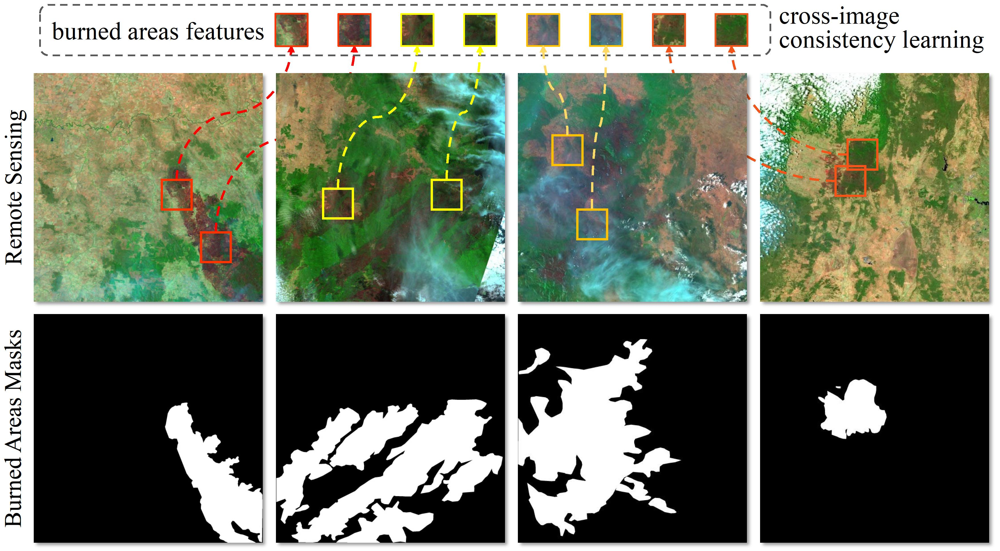
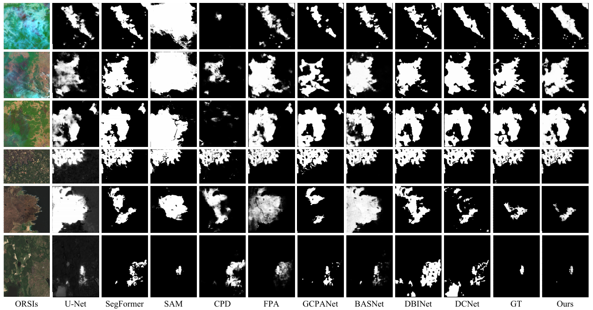

# SCCL: Exploring Self-image and Cross-image Consistency Learning for Remote Sensing Burned Area Segmentation
The increasing global wildfires in recent years have destroyed a large number of forests and wetlands. Non-contact remote sensing technologies for burned area segmentation (BAS) offer accurate identification and delineation of burned areas.

  
**Fig. 1** Remote sensing burned area segmentation (BAS).
Different from general object segmentation, burned areas in BAS have not only 1) local context within a single image, but also 2) global context across images.
  
## Benchmark Datasets

- [BAS-AUS](https://pan.baidu.com/s/1W_sJp-El8KU2Fzogqs98fA) 
- [BAS-EUR](https://pan.baidu.com/s/1W_sJp-El8KU2Fzogqs98fA) 

## Experimental Results on BAS datasets

**TABLE I.** Quantitative comparisons on two BAS datasets. The best results are shown in **bold**.

  

**Fig. 2** Visual comparisons of different SOTA methods.
		This figure shows that our proposed method (Ours) consistently generates burned masks close to the Ground Truth (GT).
		Zoom in for details.

## Evaluation
> We use this [Saliency-Evaluation-Toolbox](https://github.com/jiwei0921/Saliency-Evaluation-Toolbox) for evaluating all BAS results.
