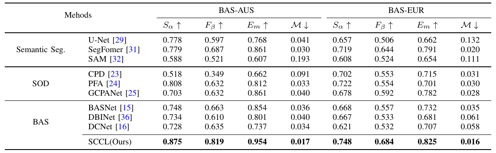

# SCCL: Exploring Self-image and Cross-image Consistency Learning for Remote Sensing Burned Area Segmentation
The increasing global wildfires in recent years have destroyed a large number of forests and wetlands. Non-contact remote sensing technologies for burned area segmentation (BAS) offer accurate identification and delineation of burned areas.

  
**Fig. 1** Remote sensing burned area segmentation (BAS).
Different from general object segmentation, burned areas in BAS have not only 1) local context within a single image, but also 2) global context across images.

## Requirements
- Ubuntu 18.04
- Python 3.10
- Pytorch 1.90
- CUDA 11.4

## Benchmark Datasets
After preparing data set, the [BAS_AUS](https://pan.baidu.com/s/1_DK2vhHZEEI37U-QzXUziw)[nnmm] / [BAS_EUR](https://pan.baidu.com/s/1qIsHjfNoXoISfMJKzDIz8A)[mnqk]data folder should be like the format below:
```
├── BAS_AUS
│   ├── test
│   │   ├── edge
│   │   │   ├── xxxxx.jpeg
│   │   │   ├── ......
│   │   ├── image
│   │   │   ├── xxxxx.jpeg
│   │   │   ├── ......
│   │   └── mask
│   │       ├── xxxxxx.jpeg
│   │       ├── ......
│   └── train
│       ├── edge
│       │   ├── xxxxx.jpeg
│       │   ├── ......
│       ├── image
│       │   ├── xxxx.jpeg
│       │   ├── ......
│       └── mask
│           ├── xxx.jpeg
│           ├── ......
```


## Experimental Results on BAS datasets

**TABLE I.** Quantitative comparisons on two BAS datasets. The best results are shown in **bold**.

  


**Fig. 2** Visual comparisons of different SOTA methods.
		This figure shows that our proposed method (Ours) consistently generates burned masks close to the Ground Truth (GT).
		Zoom in for details.
## Training
```train.py``` contains the main training function code, and some parameters and dataset loactions need to be specified.
```python
python train.py --model_name "SCCL" --mode "train" --data_dir "dataset/BAS-AUS" 
```


## Evaluation
> We use this [Saliency-Evaluation-Toolbox](https://github.com/jiwei0921/Saliency-Evaluation-Toolbox) for evaluating all BAS results.
